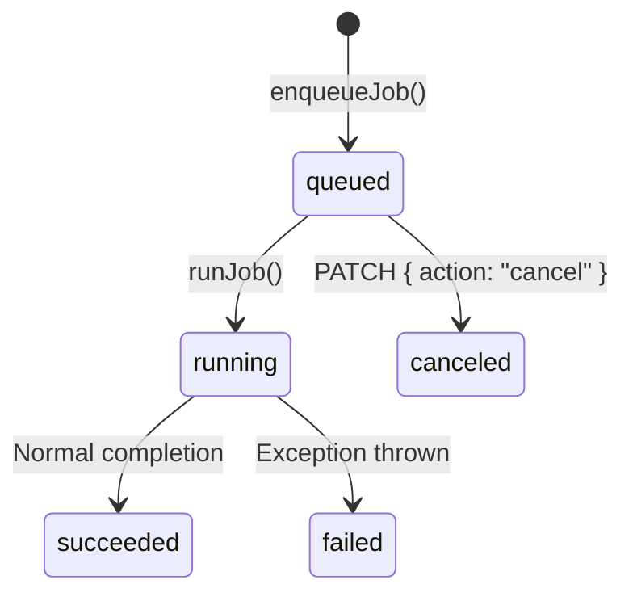

# Data Model

## SQLite Database

**Path:** `data/vibemon.db`
**Access:** `getDb()` singleton (`src/lib/db/index.ts`) — MUST
**Configuration:** WAL mode (`PRAGMA journal_mode = WAL`)
**Schema:** `src/lib/db/schema.sql` — automatically executed via `db.exec(schema)` on app start (idempotent)

> **Note:** Both `schema.sql` and the inline fallback schema in `db/index.ts` must be modified together. See [Schema Modification Guide](../guides/modify-schema.md).

---

## Tables

### `users`

User profiles and settings.

```sql
CREATE TABLE IF NOT EXISTS users (
  id           TEXT PRIMARY KEY,            -- UUID v4
  display_name TEXT NOT NULL,               -- Display name
  preferred_name TEXT,                      -- Preferred name (optional)
  locale       TEXT DEFAULT 'en',           -- Language code
  timezone     TEXT DEFAULT 'UTC',          -- Timezone
  preferences  TEXT DEFAULT '{}',           -- JSON: user settings object
  created_at   TEXT DEFAULT (datetime('now')), -- ISO 8601
  updated_at   TEXT DEFAULT (datetime('now'))  -- ISO 8601
);
```

**JSON columns:** `preferences`

---

### `skills`

Task definitions that the agent can execute.

```sql
CREATE TABLE IF NOT EXISTS skills (
  id             TEXT PRIMARY KEY,
  name           TEXT NOT NULL,
  goal           TEXT NOT NULL,             -- Used directly as LLM prompt
  trigger_type   TEXT NOT NULL CHECK (trigger_type IN ('manual', 'schedule', 'event')),
  trigger_config TEXT DEFAULT '{}',         -- JSON: per-trigger configuration
  tools          TEXT DEFAULT '[]',         -- JSON: allowed tool name array (empty = all allowed)
  budget         TEXT DEFAULT '{}',         -- JSON: cost limit settings
  output_config  TEXT DEFAULT '{}',         -- JSON: output format settings
  memory_config  TEXT DEFAULT '{}',         -- JSON: memory storage settings
  enabled        INTEGER DEFAULT 1,         -- 0=disabled, 1=enabled
  created_at     TEXT DEFAULT (datetime('now')),
  updated_at     TEXT DEFAULT (datetime('now'))
);
```

**JSON columns:** `trigger_config`, `tools`, `budget`, `output_config`, `memory_config`

**TypeScript type (API response):**
```typescript
interface Skill {
  id: string;
  name: string;
  goal: string;
  trigger_type: 'manual' | 'schedule' | 'event';
  trigger_config: string;  // JSON string — requires parse
  tools: string;           // JSON string — requires parse
  budget: string;          // JSON string — requires parse
  output_config: string;   // JSON string — requires parse
  memory_config: string;   // JSON string — requires parse
  enabled: number;         // SQLite boolean: 0 | 1
  created_at: string;
  updated_at: string;
}
```

---

### `schedules`

Cron-based automatic execution settings for skills.

```sql
CREATE TABLE IF NOT EXISTS schedules (
  id         TEXT PRIMARY KEY,
  skill_id   TEXT NOT NULL REFERENCES skills(id),
  cron_expr  TEXT NOT NULL,
  enabled    INTEGER DEFAULT 1,
  last_run_at TEXT,                         -- ISO 8601, last execution time
  next_run_at TEXT,                         -- ISO 8601, currently unused
  created_at TEXT DEFAULT (datetime('now'))
);
```

**Supported Cron Patterns** (`lib/loops/scheduler.ts` `parseCronInterval`):

| Pattern | Meaning |
|---------|---------|
| `*/N * * * *` | Every N minutes |
| `0 * * * *` | Every hour on the hour |
| `0 0 * * *` | Daily at midnight |

Other patterns cause `parseCronInterval()` to return `null` and skip execution.

---

### `jobs`

Skill execution instances. Managed as a state machine.

```sql
CREATE TABLE IF NOT EXISTS jobs (
  id           TEXT PRIMARY KEY,
  skill_id     TEXT REFERENCES skills(id),  -- nullable (for direct queuing)
  trigger_type TEXT NOT NULL,               -- 'manual' | 'schedule' | 'event'
  status       TEXT NOT NULL DEFAULT 'queued'
               CHECK (status IN ('queued','running','succeeded','failed','canceled')),
  input        TEXT DEFAULT '{}',           -- JSON: job input parameters
  result       TEXT,                        -- JSON: job result (filled after completion)
  error        TEXT,                        -- Error message (when status='failed')
  user_id      TEXT,                        -- Requesting user ID
  created_at   TEXT DEFAULT (datetime('now')),
  started_at   TEXT,                        -- Execution start time
  completed_at TEXT                         -- Completion/failure/cancellation time
);
```

**JSON columns:** `input`, `result`

**State transitions:**



---

### `step_runs`

Individual tool call records within a job.

```sql
CREATE TABLE IF NOT EXISTS step_runs (
  id           TEXT PRIMARY KEY,
  job_id       TEXT NOT NULL REFERENCES jobs(id),
  tool_name    TEXT NOT NULL,
  input        TEXT DEFAULT '{}',           -- JSON: tool input
  output       TEXT,                        -- JSON: tool output (on success)
  error        TEXT,                        -- Error message (on failure)
  started_at   TEXT DEFAULT (datetime('now')),
  completed_at TEXT,
  artifact_path TEXT                        -- Path to file generated by tool (optional)
);
```

**JSON columns:** `input`, `output`

---

### `memory_notes`

Agent's persistent memory. Categorized into four kinds: `log`, `summary`, `rule`, `soul`.

```sql
CREATE TABLE IF NOT EXISTS memory_notes (
  id           TEXT PRIMARY KEY,
  kind         TEXT NOT NULL CHECK (kind IN ('log','summary','rule','soul')),
  content      TEXT NOT NULL,
  scope        TEXT DEFAULT 'user',
  user_id      TEXT,
  tags         TEXT DEFAULT '[]',           -- JSON: tag array
  confidence   REAL DEFAULT 1.0,            -- Confidence 0.0~1.0
  stability    TEXT DEFAULT 'stable'
               CHECK (stability IN ('volatile','stable','permanent')),
  ttl_days     INTEGER,                     -- TTL (days). Required for volatile notes
  expires_at   TEXT,                        -- ISO 8601. NULL = never expires
  sensitivity  TEXT DEFAULT 'normal'
               CHECK (sensitivity IN ('normal','sensitive')),
  evidence     TEXT DEFAULT '[]',           -- JSON: evidence reference array
  job_id       TEXT,                        -- ID of job that created this note
  superseded_by TEXT,                       -- ID of new note that supersedes this one
  created_at   TEXT DEFAULT (datetime('now')),
  updated_at   TEXT DEFAULT (datetime('now'))
);
```

**JSON columns:** `tags`, `evidence`

**TypeScript interface** (`lib/memory/notes.ts`):

```typescript
type NoteKind = 'log' | 'summary' | 'rule' | 'soul';

interface MemoryNote {
  id: string;
  kind: NoteKind;
  content: string;
  scope: string;                             // default: 'user'
  userId?: string;
  tags: string[];                            // already parsed array
  confidence: number;
  stability: 'volatile' | 'stable' | 'permanent';
  ttlDays?: number;
  expiresAt?: string;
  sensitivity: 'normal' | 'sensitive';
  evidence: string[];                        // already parsed array
  jobId?: string;
  supersededBy?: string;
  createdAt: string;
  updatedAt: string;
}
```

**Query filters (`getNotes`):**
- `expires_at IS NULL OR expires_at > datetime('now')` — excludes expired notes
- `superseded_by IS NULL` — excludes superseded notes (applied after tags filter)
- `sensitivity != 'sensitive'` — additional filter when building Context Pack

---

## Vector Embeddings (sqlite-vec)

When the `sqlite-vec` extension is loaded, virtual tables are used for vector search.

```sql
-- sqlite-vec virtual table (not in schema file, created at runtime)
-- rowid = memory_notes.id
vec_notes (embedding FLOAT[1536])  -- text-embedding-3-small dimensions
```

**Graceful Degradation:** If `sqlite-vec` fails to load, vector features are disabled and fall back to plain text queries. No error is thrown.

---

## Event Store (JSONL)

An immutable audit log stored on the filesystem, separate from SQLite.

**Path pattern:** `data/events/{YYYY-MM-DD}/{userId}.jsonl`

**Example:** `data/events/2024-01-15/user_default.jsonl`

**Event structure:**
```typescript
interface AppEvent {
  id: string;        // UUID v4
  type: string;      // 'user_message' | 'assistant_message' | ...
  userId: string;
  timestamp: string; // ISO 8601
  payload: Record<string, unknown>;
}
```

**Characteristics:**
- Append-only (no deletions)
- Not queried from SQLite — for audit/replay purposes only
- Readable only via `readEvents(userId, date)` function
