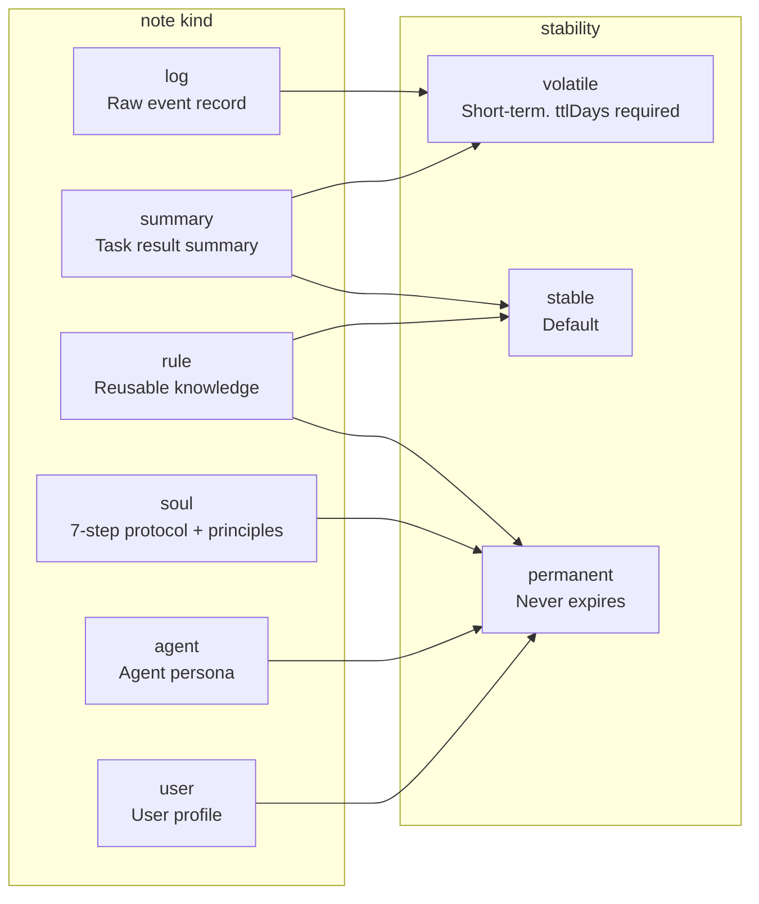
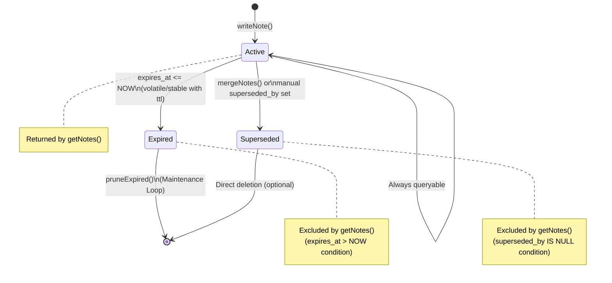

# Memory System

Luminary's memory system allows the agent to remember and reuse information. It consists of six kinds of notes (`log`, `summary`, `rule`, `soul`, `agent`, `user`), TTL-based expiration, and vector embedding search.

---

## Note Kinds (6 Kinds)



| Kind | Purpose | Typical stability | ttlDays example |
|------|---------|-------------------|-----------------|
| `log` | Raw record of user requests and system events | `volatile` | 30 days |
| `summary` | Summary of job/session results (goal, actions taken, next steps) | `volatile` | 7 days |
| `rule` | Reusable knowledge. High confidence with evidence | `stable` / `permanent` | none |
| `soul` | 7-step reasoning protocol + behavioral principles. System constant | `permanent` | none |
| `agent` | Agent persona: name, personality, speaking style. User-configurable | `permanent` | none |
| `user` | User profile: name, timezone, interests. Synced from users table | `permanent` | none |

### Kind Selection Guide

```
User made a request / System event occurred
  → log

Job completed / Session ended
  → summary

Repeated pattern discovered / Rule to follow going forward
  → rule (confidence 0.8+, evidence[] required)

Agent reasoning protocol / Core behavioral principles
  → soul (permanent; only ONE active soul per user via supersededBy chain)

Agent persona (name, personality, style)
  → agent (permanent; updated via update_soul tool or settings save)

User profile (name, timezone, interests)
  → user (permanent; synced from users table on each request)
```

---

## Note Lifecycle



### TTL Calculation

```typescript
// Inside writeNote()
if (input.ttlDays) {
  const exp = new Date();
  exp.setDate(exp.getDate() + input.ttlDays);
  expiresAt = exp.toISOString();
}
```

- Without `ttlDays`, `expires_at = NULL` → preserved permanently
- `stability: 'volatile'` notes without `ttlDays` become targets for the Maintenance Loop's 7-day batch merge

---

## Agent Context

The mechanism for injecting memory into the LLM prompt during chat response generation.

**File:** `src/lib/agent/context.ts`

### Build Process

`buildAgentContext(userId, message?)` builds the system prompt with six priority layers:

```typescript
async function buildAgentContext(userId: string, message?: string): Promise<string> {
  // 1. Agent note (kind='agent'): who the agent is — name, personality, style
  // 2. Soul note  (kind='soul'):  how the agent thinks — 7-step protocol + principles
  // 3. OS/platform environment:  always injected so agent uses correct shell commands
  // 4. User note  (kind='user'):  who the user is — name, timezone, interests
  // 5. Rule notes: semantically relevant to message (or most recent)
  // 6. Summary notes: semantically relevant to message (or most recent)
}
```

### Semantic Retrieval

When `OPENAI_API_KEY` is set and sqlite-vec is available, rules and summaries are retrieved by **vector similarity** to the current `message` (not just recency):

```typescript
const queryVec = await getEmbedding(message);
const ids = await searchSimilar(queryVec, 15);  // top-15 relevant note IDs
// → fill remainder with recent notes if not enough semantic matches
```

### Filtering Rules

| Condition | Description |
|-----------|-------------|
| `expires_at > NOW` | Automatically applied inside `getNotes()` |
| `superseded_by IS NULL` | Automatically applied inside `getNotes()` |
| `sensitivity != 'sensitive'` | Excluded from context (rules + summaries) |
| Semantic search | Relevance-prioritized when embeddings available; recency fallback |
| `limit: 10 rules, 5 summaries` | Maximum counts per kind |

**Priority order:** agent → soul → OS environment → user → rules → summaries

---

## Vector Embedding Pipeline

**File:** `src/lib/memory/embeddings.ts`

### Components

```mermaid
graph LR
    Text[Note content] -->|getEmbedding()| OAI[OpenAI\ntext-embedding-3-small\n1536 dimensions]
    OAI --> Vec[Float32Array]
    Vec -->|storeEmbedding()| VT[vec_notes virtual table\nsqlite-vec]

    Query[Search query] -->|getEmbedding()| OAI2[OpenAI]
    OAI2 --> QVec[Query vector]
    QVec -->|searchSimilar()| VT
    VT -->|L2 distance| NoteIDs[memory_notes.id list]
```

### API

```typescript
// Generate embedding (OpenAI API call)
async function getEmbedding(text: string): Promise<number[]>

// Store vector
async function storeEmbedding(noteId: string, vector: number[]): Promise<void>

// Search similar notes (L2 distance)
async function searchSimilar(queryVector: number[], limit?: number): Promise<string[]>
// → returns array of memory_notes.id
```

### Graceful Degradation

When `sqlite-vec` fails to load or virtual table is not created:
- `storeEmbedding()`: logs warning to console and returns (no error thrown)
- `searchSimilar()`: logs warning to console and returns empty array

**Current status:** `storeEmbedding()` / `searchSimilar()` are implemented but not yet called from `buildContextPack()`. Planned for future integration with the `_query` parameter.

---

## Memory Note API

**File:** `src/lib/memory/notes.ts`

### writeNote

```typescript
function writeNote(input: WriteNoteInput): MemoryNote

interface WriteNoteInput {
  kind: NoteKind;           // 'log' | 'summary' | 'rule' | 'soul'
  content: string;
  scope?: string;           // default: 'user'
  userId?: string;
  tags?: string[];          // default: []
  confidence?: number;      // default: 1.0
  stability?: 'volatile' | 'stable' | 'permanent';  // default: 'stable'
  ttlDays?: number;         // required for volatile
  sensitivity?: 'normal' | 'sensitive';  // default: 'normal'
  evidence?: string[];      // default: []
  jobId?: string;
}
```

### getNotes

```typescript
function getNotes(filter?: GetNotesFilter): MemoryNote[]

interface GetNotesFilter {
  userId?: string;
  kind?: NoteKind;
  scope?: string;
  tags?: string[];  // OR condition (any match)
  limit?: number;   // default: 50
}
```

**Note:** The `tags` filter is applied at the JavaScript level, not SQL level (SQLite JSON functions not used).

### pruneExpired

```typescript
function pruneExpired(): number  // returns count of deleted rows
```

Called by Maintenance Loop. Deletes by `expires_at <= NOW` condition.

### mergeNotes

```typescript
function mergeNotes(ids: string[]): MemoryNote | null
```

- Merges 2+ notes into a single `summary` note
- Marks original notes with `superseded_by = new note ID`
- Called by Maintenance Loop in batches of 5

---

## Memory Usage Patterns

### Currently Implemented Patterns

| Situation | Who writes | kind | stability | ttlDays |
|-----------|-----------|------|-----------|---------|
| User mentions "remember/note" | Interactive Loop | `log` | `volatile` | 30 |
| Job completed | Job Runner | `summary` | `volatile` | 7 |
| Agent tool `remember` called | Agent Tool | `log` (default) | `stable` | none |
| Agent tool `update_soul` called | Agent Tool | `soul` | `permanent` | none |

### Extension Points

When a new memory note needs to be created:
1. Call `writeNote()` directly (simplest)
2. Call via the `remember` agent tool during a chat session
3. Trigger from a new loop or event handler
