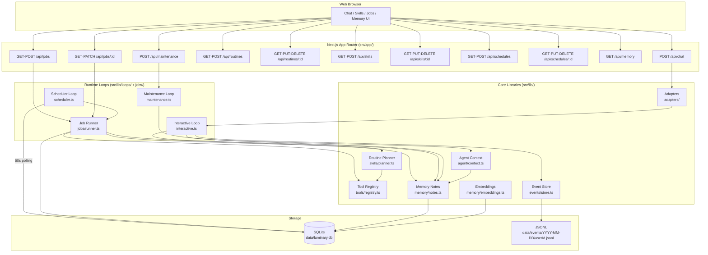
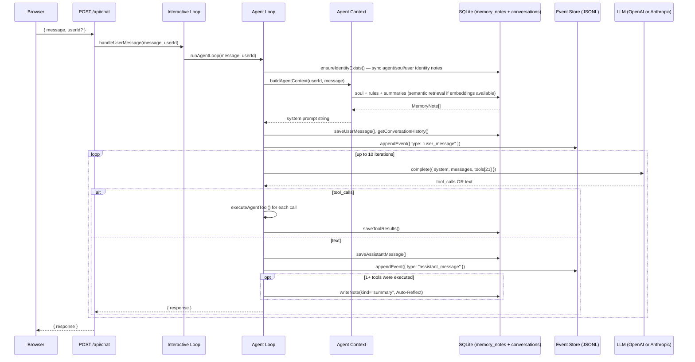
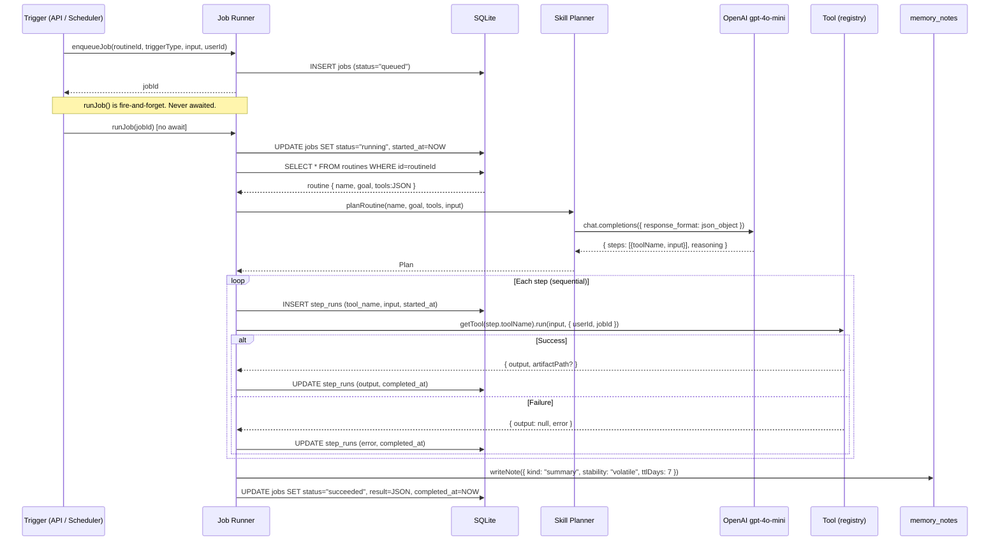
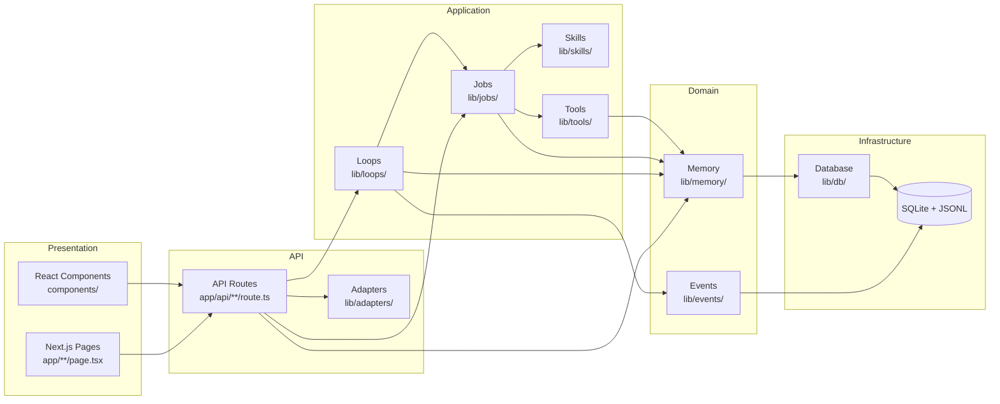

# Architecture Overview

## System Architecture

Luminary is a local-first agent runtime built on Next.js 16 App Router. Four independent runtime loops operate with their own triggers, managing state through a shared SQLite DB and JSONL event store.

---

## Component Responsibilities

| Component | File | Role |
|-----------|------|------|
| Interactive Loop | `lib/loops/interactive.ts` | Receives user messages → delegates to `runAgentLoop()` |
| Agent Loop | `lib/agent/loop.ts` | Agentic loop: soul init → context build → LLM call → tool execution → auto-summary |
| Job Runner | `lib/jobs/runner.ts` | Queues and executes routine jobs, manages tool call ordering, records step_runs |
| Scheduler Loop | `lib/loops/scheduler.ts` | Polls `schedules` table every 60 seconds, fires routine jobs or direct tool calls |
| Maintenance Loop | `lib/loops/maintenance.ts` | Deletes expired notes, batch-merges volatile notes older than 7 days |
| Routine Planner | `lib/skills/planner.ts` | Generates routine execution plan (`Plan`) using LLM |
| Tool Registry | `lib/tools/registry.ts` | Defines `Tool` interface, name-based tool lookup map |
| Memory Notes | `lib/memory/notes.ts` | `memory_notes` CRUD, TTL expiration, note merging |
| Agent Context | `lib/agent/context.ts` | Builds system prompt: soul → rules → summaries, with semantic retrieval |
| Soul | `lib/agent/soul.ts` | Agent identity notes; `ensureIdentityExists()` syncs all 3 identity notes (agent/soul/user) per request |
| Embeddings | `lib/memory/embeddings.ts` | `sqlite-vec` vector storage and search, OpenAI `text-embedding-3-small` |
| Event Store | `lib/events/store.ts` | Immutable JSONL audit log writing and reading |
| Input Adapter | `lib/adapters/input/web.ts` | HTTP request body → `WebInputMessage` type conversion |

---

## Chat Message Flow

---

## Job Execution Flow

---

## Layer Architecture

**Dependency direction:** Upper layer → Lower layer. Reverse imports are forbidden.
