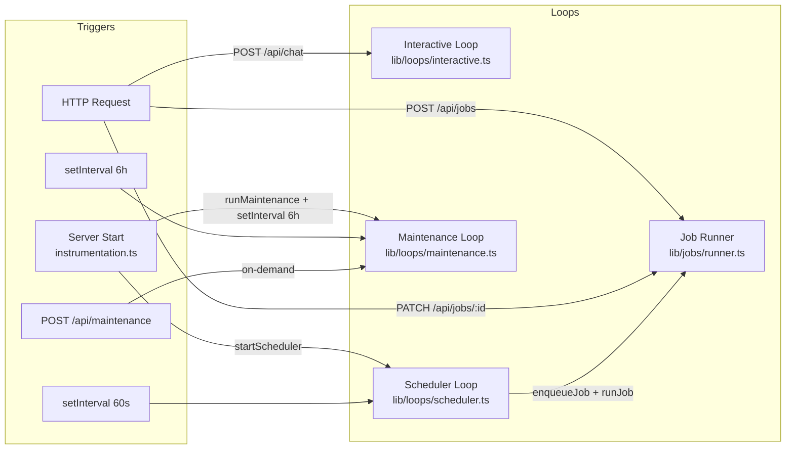
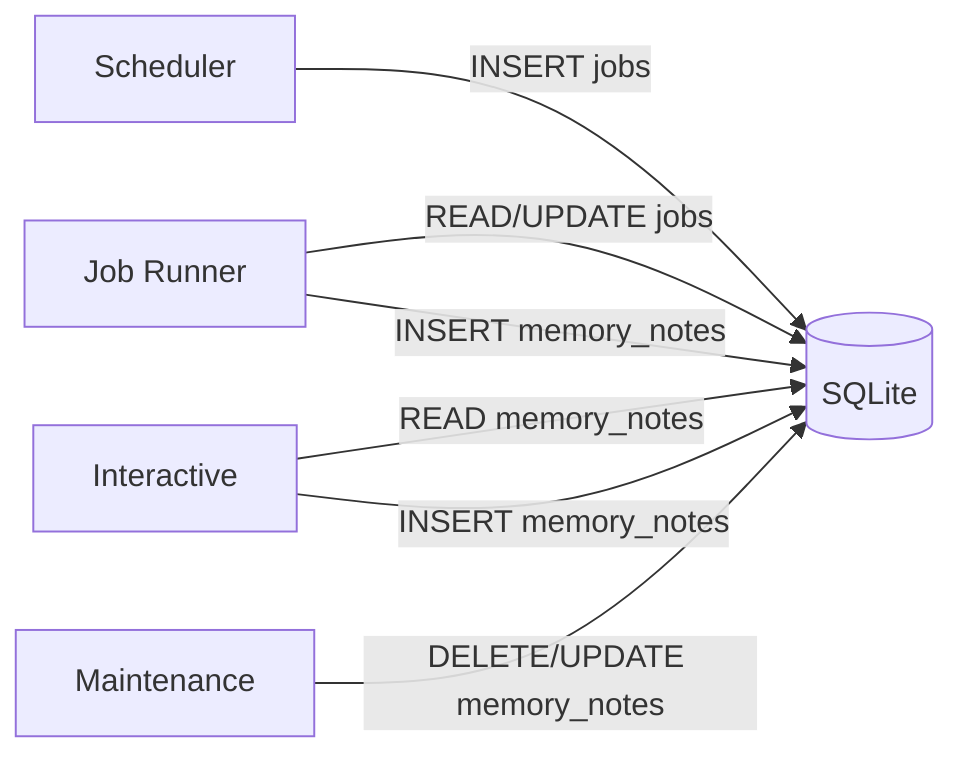

# Runtime Loops

vibemon-agent consists of four independent runtime loops. Each loop has a different trigger mechanism and communicates indirectly through the shared SQLite DB.

---

## Loop Overview



| Loop | Entry Point | Trigger | Sync/Async |
|------|-------------|---------|------------|
| Interactive | `handleUserMessage()` | POST /api/chat | Synchronous (await) |
| Job Runner | `enqueueJob()` + `runJob()` | API or Scheduler | Asynchronous (fire-and-forget) |
| Scheduler | `startScheduler()` | Server start → `setInterval` 60s | Asynchronous loop |
| Maintenance | `runMaintenance()` | Server start + every 6h + POST /api/maintenance | Synchronous (await) |

---

## 1. Interactive Loop

**File:** `src/lib/loops/interactive.ts`
**Entry:** `POST /api/chat` → `handleUserMessage(message, userId, threadId?)`

### Responsibilities
- Receives user messages and generates responses via the agentic loop
- Injects memory context into the system prompt
- Records conversation in persistent history
- Supports multi-turn dialogue with tool use (up to 10 iterations)

### Execution Order
```
1. ensureSoulExists(userId)  ← initialize soul on first call
2. buildAgentContext(userId) ← soul → rule → summary priority
3. runAgentLoop(message, userId, systemPrompt)
   a. saveUserMessage(userId, message)
   b. getConversationHistory(userId)
   c. LLM call with tools
   d. If tool_calls → executeAgentTool() → saveToolResults()
   e. If text response → saveAssistantMessage() → return
   f. Repeat up to MAX_ITERATIONS (10)
4. return { response }
```

### Constraints
- Responses are not streamed — single completion response (`complete()`)
- Conversation history is trimmed to MAX_ROWS=80 entries

---

## 2. Job Runner

**File:** `src/lib/jobs/runner.ts`
**Entry:** `enqueueJob()` → (optional) `runJob()`

### Responsibilities
- Queues skill jobs into SQLite
- Generates execution plan (Plan) via skill planner
- Sequentially executes tools and records step_runs
- Creates summary memory note after job completion

### Two-Phase Separation

```typescript
// Phase 1: Queuing (synchronous)
const jobId = await enqueueJob(skillId, 'manual', input, userId);
// → INSERT into jobs table with status='queued'

// Phase 2: Execution (asynchronous, fire-and-forget)
runJob(jobId).catch(e => console.error('Job run error:', e));
// → Never awaited. API returns jobId immediately
```

### Internal Execution Flow

```
runJob(jobId):
  1. Fetch job from DB (throw if not found)
  2. UPDATE jobs SET status='running', started_at=NOW
  3. If skill_id is set:
     a. Fetch skill from DB
     b. planSkill(name, goal, tools, input) → Plan { steps, reasoning }
     c. Execute each step sequentially:
        - INSERT step_runs (tool_name, input, started_at)
        - getTool(step.toolName).run(input, { userId, jobId })
          - If tool not found: record step error and continue (job not aborted)
          - If exception thrown: record step error and continue
        - UPDATE step_runs (output/error, completed_at)
     d. writeNote({ kind: 'summary', stability: 'volatile', ttlDays: 7 })
  4. UPDATE jobs SET status='succeeded', result=JSON, completed_at=NOW
  5. On exception: UPDATE jobs SET status='failed', error=msg
```

### Important Design Decisions
- **Step failure does not abort the job.** A failed step records its error and continues to the next step.
- **Unregistered tools are soft failures.** If `getTool(name)` returns `undefined`, the job continues.
- Tool registration happens via side-effect imports at the top of `runner.ts`:
  ```typescript
  import '../tools/summarize';
  import '../tools/remember';
  import '../tools/search';
  import '../tools/list_memory';
  ```

---

## 3. Scheduler Loop

**File:** `src/lib/loops/scheduler.ts`
**Entry:** `startScheduler()` — called once from `src/instrumentation.ts` on server start

### Responsibilities
- Polls the `schedules` table every 60 seconds
- Calculates execution interval based on `last_run_at`
- Calls `enqueueJob()` + `runJob()` when conditions are met

### Bootstrap

`startScheduler()` is invoked by the Next.js instrumentation hook:

```typescript
// src/instrumentation.ts
export async function register() {
  if (process.env.NEXT_RUNTIME !== 'nodejs') return;
  const { startScheduler } = await import('./lib/loops/scheduler');
  startScheduler();
}
```

### Cron Parser Limitations

```typescript
function parseCronInterval(cronExpr: string): number | null
```

Supported patterns:

| Input | Returns (ms) |
|-------|-------------|
| `*/5 * * * *` | 300,000 (5 minutes) |
| `*/30 * * * *` | 1,800,000 (30 minutes) |
| `0 * * * *` | 3,600,000 (1 hour) |
| `0 0 * * *` | 86,400,000 (1 day) |
| Other | `null` → skip execution |

### Duplicate Execution Prevention

```typescript
let schedulerStarted = false;

export function startScheduler(): void {
  if (schedulerStarted) return;  // already started
  if (process.env.NEXT_PHASE === 'phase-production-build') return;  // skip during build
  schedulerStarted = true;
  // ...
}
```

### Execution Decision Logic

```
now - last_run_at >= interval → execute
if last_run_at is not set → execute immediately
```

---

## 4. Maintenance Loop

**File:** `src/lib/loops/maintenance.ts`
**Entry:** Three triggers:
1. Server start — runs once 5 s after `src/instrumentation.ts` executes
2. Automatic — `setInterval` every 6 hours (started by `instrumentation.ts`)
3. On-demand — `POST /api/maintenance`

### Responsibilities
- Deletes expired memory notes
- Batch-merges volatile notes older than 7 days

### Execution Order

```
1. pruneExpired()
   → DELETE FROM memory_notes
     WHERE expires_at IS NOT NULL AND expires_at <= datetime('now')
   → Returns count of deleted rows

2. getNotes({ limit: 100 })
   → Filter volatile notes: stability='volatile' AND superseded_by IS NULL
   → Filter notes older than 7 days: createdAt < 7 days ago

3. If oldVolatile.length >= 3:
   → Split into batches of 5
   → For each batch, mergeNotes(batch.ids):
     - Create new summary note (combined content)
     - Mark merged notes with superseded_by = new note ID

4. return { pruned, merged, message }
```

### Return Type

```typescript
interface MaintenanceResult {
  pruned: number;  // Number of expired notes deleted
  merged: number;  // Number of batches merged (not note count)
  message: string; // Summary message
}
```

---

## Inter-Loop Communication

Loops communicate **indirectly through the SQLite DB** without direct calls:



**Exception:** Scheduler → Job Runner uses direct function calls (`enqueueJob` + `runJob`) because they operate within the same process.
